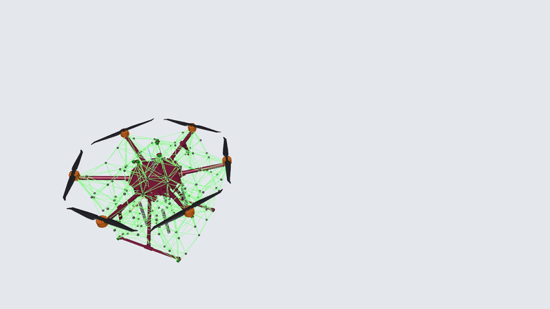

# OpenPRC: Physical Reservoir Computing Framework

[](https://www.python.org/downloads/)
[](LICENSE)
[](https://developer.nvidia.com/cuda-zone)
[](https://arxiv.org/abs/2604.07423)

**OpenPRC** is a modular, GPU-accelerated Python framework for simulating and evaluating physical reservoir computers — mechanical systems that process information through their intrinsic dynamics.

If you use OpenPRC in your research, please cite:

```bibtex
@article{phalak2026openprc,
  title={OpenPRC: A Unified Open-Source Framework for Physics-to-Task Evaluation in Physical Reservoir Computing},
  author={Phalak, Yogesh and Lor, Wen Sin and Khairnar, Apoorva and Jantzen, Benjamin and Naughton, Noel and Li, Suyi},
  journal={arXiv preprint arXiv:2604.07423},
  year={2026}
}
```

---

## Simulation Capabilities

OpenPRC supports diverse mechanical substrates ranging from compliant mass-spring networks to rigid-foldable origami. Below are examples of validated simulation outputs:

<table>
  <tr>
    <td align="center" colspan="2">
      <br/>
      <b>DJI Matrice 600</b><br/>
      Aerial platform dynamics
    </td>
  </tr>
  <tr>
    <td align="center">
      <br/>
      <b>Soft Reservoir Network</b><br/>
      Mass-spring lattice under dynamic actuation
    </td>
    <td align="center">
      <br/>
      <b>Miura-Ori Tessellation</b><br/>
      Rigid-foldable origami pattern
    </td>
  </tr>
  <tr>
    <td align="center">
      <br/>
      <b>Kirigami Structure</b><br/>
      Compliant network with geometric cuts
    </td>
    <td align="center">
      <br/>
      <b>K-Cone Origami</b><br/>
      Non-periodic origami configuration
    </td>
  </tr>
  <tr>
    <td align="center">
      <br/>
      <b>Bistable Slab</b><br/>
      Multistable mechanical metamaterial
    </td>
    <td align="center">
      <br/>
      <b>Tapered Spring</b><br/>
      Nonlinear elastic element dynamics
    </td>
  </tr>
</table>

---

## Installation

```bash
pip install openprc

# With GPU support
pip install openprc[cuda]

# With all optional dependencies
pip install openprc[full]
```

### Dependencies

| Package | Purpose | Extra |
|---------|---------|-------|
| `numpy`, `h5py`, `scipy` | Core numerics and I/O | *(always)* |
| `numba` | JIT-compiled CPU physics | *(always)* |
| `scikit-learn` | Ridge readout | *(always)* |
| `piviz-3d`, `imgui` | 3-D animator (Quick Start viewer) | *(always)* |
| `pycuda` | CUDA backend | `[cuda]` |
| `jax` / `jaxlib` | Differentiable JAX backend | `[jax]` |
| `opencv-python` | Vision utilities | `[vision]` |
| `trimesh`, `rosbags`, `yourdfpy` | Robot bundle tooling | `[automod]` |

---

## Pipeline

```
┌─────────────┐     ┌─────────────┐     ┌─────────────┐     ┌─────────────┐
│   demlat    │────▶│   reservoir │────▶│   analysis  │────▶│  optimize   │
│  (Physics)  │     │  (Readout)  │     │(Diagnostics)│     │(Calibration)│
└─────────────┘     └─────────────┘     └─────────────┘     └─────────────┘
```

---

## Quick Start

```python
import numpy as np
from openprc.demlat import SimulationSetup, Simulation, Engine, ShowSimulation

EXP = "experiments/my_prc"

# ── 1. Build geometry ──────────────────────────────────────────────────────
setup = SimulationSetup(EXP, overwrite=True)
setup.set_simulation_params(duration=10.0, dt=0.001, save_interval=0.01)
setup.set_physics(gravity=-9.81, damping=0.1)

anchor = setup.add_node([0.0, 0.0, 0.0], fixed=True)
mass   = setup.add_node([1.0, 0.0, 0.0], mass=1.0)
setup.add_bar(anchor, mass, stiffness=1e4, rest_length=1.0, damping=5.0)

# ── 2. Drive with a force signal ──────────────────────────────────────────
t   = np.arange(0, 10.0, 0.001)
sig = np.stack([0.5 * np.sin(2 * np.pi * t),
                np.zeros_like(t),
                np.zeros_like(t)], axis=1).astype("float32")
setup.add_signal("drive", sig, dt=0.001)
setup.add_actuator(anchor, "drive", type="force")
setup.save()

# ── 3. Run (CUDA, or "cpu" / "jax") ──────────────────────────────────────
eng = Engine(backend="cuda")          # BarHingeModel is the default
eng.run(Simulation(EXP))

# ── 4. Animate ────────────────────────────────────────────────────────────
ShowSimulation(EXP)
```

---

## API Reference

### `demlat` — Physics Simulation

```python
from openprc.demlat import SimulationSetup, Simulation, Engine, ShowSimulation

# ── Geometry ──────────────────────────────────────────────────────────────
setup = SimulationSetup("./experiments/my_exp", overwrite=True)
setup.set_simulation_params(duration=5.0, dt=0.001, save_interval=0.01)
setup.set_physics(
    gravity=-9.81, damping=0.1,
    enable_collision=True,          # node-level sphere collision
    collision_radius=0.02,
    collision_restitution=0.6,
    collision_iterations=3,
)

n0 = setup.add_node([0.0, 0.0, 0.0], fixed=True,  collidable=True)
n1 = setup.add_node([0.5, 0.0, 0.0], mass=1.0,    collidable=True)
n2 = setup.add_node([0.5, 0.5, 0.0], mass=1.0)

setup.add_bar(n0, n1, stiffness=1e4, rest_length=0.5, damping=5.0)
setup.add_hinge([n0, n1, n2, n2], stiffness=50.0, rest_angle=np.pi / 2)

# ── Signals & Actuators ───────────────────────────────────────────────────
t   = np.arange(0, 5.0, 0.001)
pos = np.stack([0.1 * np.sin(2 * np.pi * t),
                np.zeros_like(t),
                np.zeros_like(t)], axis=1).astype("float32")
setup.add_signal("wave", pos, dt=0.001)

setup.add_actuator(n0, "wave", type="position")              # full 3-DOF
setup.add_actuator(n1, "wave", type="force", dof=[0, 0, 1]) # z-axis only
setup.save()

# ── Run ───────────────────────────────────────────────────────────────────
eng = Engine(backend="cuda")   # or "cpu" / "jax"; BarHingeModel is default
eng.run(Simulation("./experiments/my_exp"))

ShowSimulation("./experiments/my_exp")
```

### `reservoir` — Readout Training

```python
from openprc.reservoir import StateLoader, Ridge, Trainer, features

loader = StateLoader("./experiments/my_exp/output/simulation.h5")

# Node position features for selected nodes
feat = features.NodePositions(node_ids=[0, 1, 2], dims="all")
X    = feat.transform(loader)          # (T, n_features)

# Or use bar strains as the observable (stored as ε = ΔL/L₀)
feat = features.BarStrains()

# Train ridge readout
readout = Ridge(regularization=1e-4)
trainer = Trainer(
    features=feat,
    readout=readout,
    experiment_dir="./experiments/my_exp",
    loader=loader,
    washout=2.0,          # seconds to discard at start
    train_duration=6.0,
    test_duration=2.0,
)

y_target = ...            # (T,) or (T, n_outputs) numpy array
result = trainer.train(y_target, task_name="NARMA10")
result.save()
```

### `analysis` — Correlation Diagnostics, Multistability & Reach Spectroscopy

```python
from openprc.analysis import correlation as corr
from openprc.analysis import EquilibriumFinder, reach_spectroscopy

# ── Correlation diagnostics (x: features, y: targets) ────────────────────
lin = corr.Linear(x, y, lag_sweep=True)
print(lin.pearson)         # zero-lag Pearson r per channel
lin.ccf.plot()             # cross-correlation lag profiles

nr = corr.Nonparametric(x, y)
print(nr.dcor)             # distance correlation (detects nonlinear deps)

# ── Find all mechanical equilibria ───────────────────────────────────────
finder  = EquilibriumFinder.from_experiment("./experiments/my_exp")
results = finder.find_all(num_random=50)
results.summary()
finder.save_results(results, "./experiments/my_exp/equilibria.h5")

# ── Reach spectroscopy: identify the "machine" behind a driven reservoir ──
# Works on *parsed timeseries* — decoupled from any experiment directory.
from openprc.reservoir import StateLoader, features as feat

loader = StateLoader("./experiments/my_exp/output/simulation.h5")
states = feat.NodeDisplacements(reference_node=0).transform(loader)  # (T, N) readout
drive  = loader.get_actuation_signal(actuator_idx=0, dof=1)          # (T,) actuation

M = reach_spectroscopy(states, t=loader.time, drive=drive)
print(M.D)                 # reach per tolerance, e.g. {0.01: 6, 0.001: 4}
print(M.phi_n)             # harmonic phases {φ_n} of the abstraction
M.summary()                # per-harmonic capacity / quadrature table
M.plot()                   # six-panel scientific figure
M.save("./experiments/my_exp/output")   # → machine_abstraction.json + .npz

# Mask any measurement for a faster / leaner run:
M = reach_spectroscopy(states, t=loader.time, drive=drive,
                       noise_floor=False, rank=False, input_spectrum=False)
```

### `optimize` — JAX-Based Parameter Calibration

```python
from openprc.optimize import Calibration

from openprc.demlat import BarHingeModel
cal = Calibration(BarHingeModel, backend="jax")

cal.load_geometry("./experiments/my_exp")
cal.load_reference("./experiments/my_exp/output/simulation.h5")

cal.optimize_params(bar_stiffness=True, hinge_stiffness=True)
cal.set_bounds(bar_stiffness=(10.0, 1e5))

result = cal.run(max_iterations=500, lr=0.01, cost="mse")
cal.save("./experiments/my_exp/optimized_geometry.h5")
```

### `automod` — Robot PRC Pipeline

```python
import openprc.automod as automod

# Stage 1: convert URDF links to spring-mass reservoirs
automod.batch_preprocess(
    bundle_dir="./robot_bundle",
    robot_name="go1",
    params=automod.PRESETS["small"],   # "small", "medium", "large"
)

# Stage 2: run DEMLAT simulations for all trajectories
automod.batch_simulate(
    bundle_dir="./robot_bundle",
    robot_name="go1",
    splits=("train", "test"),
    gravity=-9.81, damping_scale=2.0,
)

# Stage 3: train ridge readout with k-fold CV
run_dir = automod.run_training(
    bundle_dir="./robot_bundle",
    robot_name="go1",
    features="node_vel",              # see automod.FEATURE_LEVELS
    targets=["body_vel", "qvel"],
    n_folds=5,
)

# Stage 4: generate plots
automod.plot_run(run_dir)
```

---

## License

Apache 2.0 — see [LICENSE](LICENSE).
